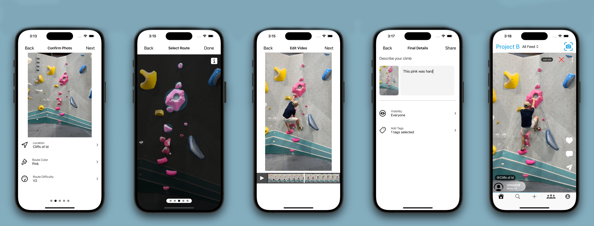

# Ascendit
### by Vincent and Ryan
# 
Ascendit is an iOS app designed for indoor bouldering enthusiasts to track their climbing achievements, log completed routes, and engage with a community of climbers. The app fosters a sense of competition and community by allowing users to upload pictures of bouldering routes, generate route IDs, and share solution videos. Points are awarded for completing routes, and a two-stage verification process ensures route accuracy, with other users able to verify uploaded routes.

## Features

- **Route Scanning**: Users can upload pictures of bouldering routes, and Ascendit will generate unique route IDs for each.
- **Solution Uploads**: Users can upload video solutions for completed routes to earn points and share their achievements.
- **Two-Stage Verification**: Uploaded routes and solutions can be verified by other users, ensuring accuracy and fair competition.
- **Community and Competition**: The app encourages climbers to challenge themselves, compare progress, and engage with others in the community through shared routes and points.
- **Achievement Tracking**: Climbers can track their completed routes, points, and overall progress.
